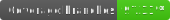
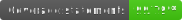

# Porfolio Gen



Portfolio Gen is a web app built in Next.js to be used to generate a portfolio page based on a [JSONResume](https://jsonresume.org/) file.

## Installation

Use NPM to install Portfolio Gen packages.

```bash
git clone https://github.com/adrianbgo/port-gen port-gen
cd ./port-gen
npm i
```

## Usage

Ensure a resume.json or \*.resume.json file exists in the root of this repository.

run `npm run dev` to start the local app.

## Roadmap

### v1.0.0

- [ ] Generate a site from just a resume.json file
- [ ] Create a basic resume.json builder

### v2.0.0

- [ ] Allow for upload of existing resume pdf to convert to resume.json

## License

[MIT](https://choosealicense.com/licenses/mit/)
